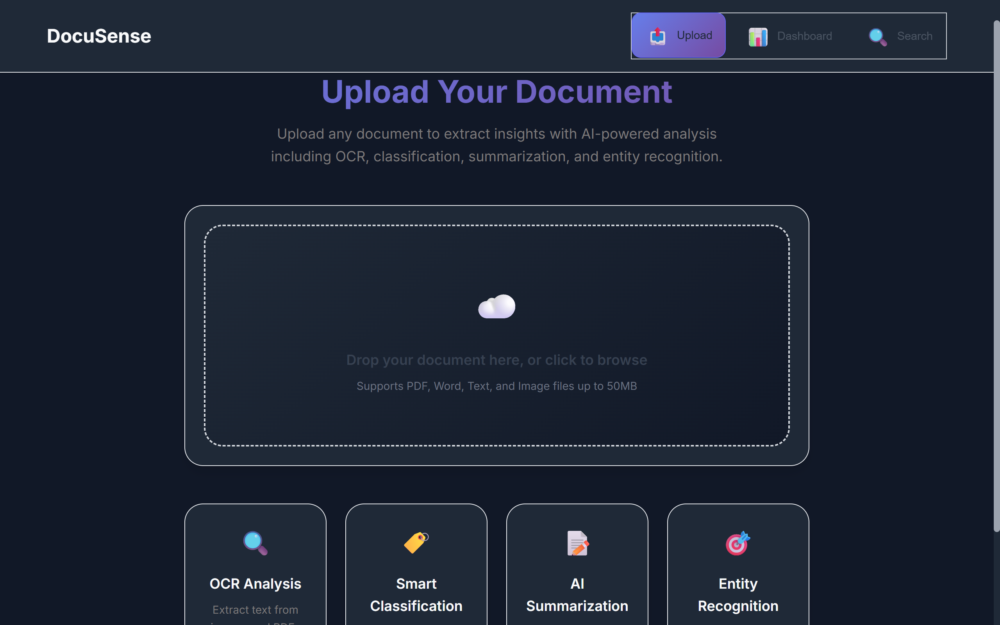
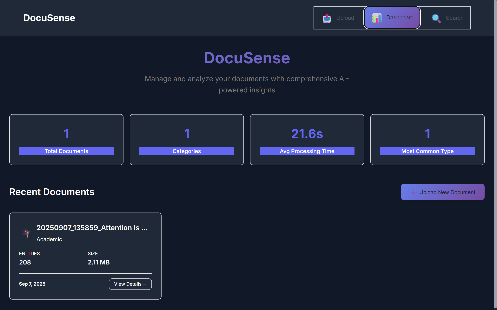
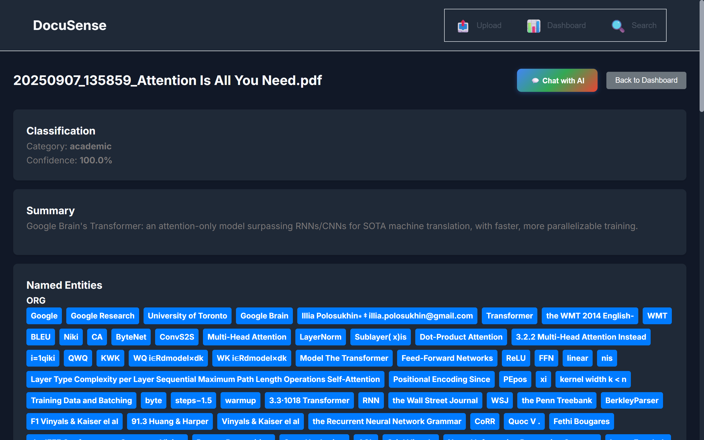

# 📄 DocuSense – Document Intelligence Platform 🚀

[](https://www.python.org/)
[](https://reactjs.org/)
[](https://fastapi.tiangolo.com/)
[](https://opensource.org/licenses/MIT)

**DocuSense** is an AI-powered platform that enables users to upload, analyze, and interact with their documents in a smarter way. Powered by cutting-edge technologies like Google Gemini AI, Tesseract OCR, FAISS, and Sentence Transformers, DocuSense extracts insights, enables semantic search, and supports interactive Q&A—helping users efficiently manage and understand document data.

---

## ✨ Features

### 📄 Document Upload & Processing
- Upload PDFs or scanned documents.
- Complete pipeline for AI-driven analysis including OCR, summarization, entity recognition, and classification.

### 🔍 OCR Text Extraction
- Accurate extraction of text from images and scanned PDFs using Tesseract OCR.

### 🤖 AI-Powered Analysis
- **Summarization**: Generate both extractive and abstractive summaries.
- **Named Entity Recognition (NER)**: Detect entities like names, locations, dates, and more.
- **Document Classification**: Automatically categorize documents (e.g., legal, academic, business).

### 🧠 Semantic Search
- Vector-based search using FAISS and sentence-transformers.
- Index caching for fast retrieval and query responses.

### 💬 Interactive Document Chat
- Ask questions in natural language and get context-aware answers powered by Google Gemini.
- Chat interface that understands the document’s content.

### 📊 Analytics Dashboard
- Visualize document summaries, classifications, and metadata.

### ⚙️ Scalable Architecture
- Modular backend services for AI, search, and document management.
- Easily extendable for future use cases.

---

## 🎯 Use Cases

- **Legal Professionals**: Extract key clauses and entities from case files and contracts.
- **Researchers**: Summarize papers, find related works, and explore topics faster.
- **Business Analysts**: Organize reports, extract financial data, and classify documents.
- **Knowledge Workers**: Build searchable archives of documents with intelligent interactions.

---

## 🛠 Technology Stack

| Area          | Tools & Frameworks                                 |
|---------------|----------------------------------------------------|
| **Backend**   | Python, FastAPI, Uvicorn, Pydantic, python-dotenv   |
| **AI / ML**   | Google Gemini AI, Sentence-Transformers, FAISS, Tesseract OCR |
| **Frontend**  | React 18, Axios, React Dropzone, CSS               |
| **Database**  | SQLite (metadata), easily replaceable with PostgreSQL |
| **DevOps**    | Docker, virtual environments (venv)               |

---

## 📂 Project Structure

```

.
├── app/                      # Backend application (FastAPI)
├── data/                     # Uploaded and processed document storage
├── frontend/                 # Frontend application (React)
├── requirements.txt          # Python dependencies
└── README.md                 # Project documentation

````

For full structure details, see the [Getting Started](#-getting-started) section below.

---

## 🚀 Getting Started

### 📦 Prerequisites
- Python 3.10 or higher
- Node.js 16 or higher
- Tesseract OCR installed
- Google Gemini API key

### 🔧 Setup Instructions

#### 1. Clone the Repository
```bash
git clone https://github.com/royxlead/DocuSense.git
cd DocuSense
````

#### 2. Setup Backend

```bash
python -m venv env-doc
source env-doc/bin/activate  # On Linux/macOS
# .\env-doc\Scripts\activate  # On Windows
pip install -r requirements.txt
```

#### 3. Configure Environment Variables

Create a `.env` file in the root directory:

```env
GEMINI_API_KEY="your-google-gemini-api-key"
```

#### 4. Setup Frontend

```bash
cd frontend
npm install
```

#### 5. Run the Application

Open two terminals:

**Terminal 1 – Backend:**

```bash
uvicorn app.main:app --reload --host 0.0.0.0 --port 8000
```

**Terminal 2 – Frontend:**

```bash
cd frontend
npm start
```

Visit `http://localhost:3000` to access the application.

---

## 📈 Architecture Overview

DocuSense follows a decoupled architecture:

1. **Frontend (React SPA)** – Handles file uploads, dashboards, and interactions.
2. **Backend (FastAPI)** – Provides API endpoints for document processing and querying.
3. **AI Pipeline** – OCR, summarization, classification, and embedding pipelines for text analysis.
4. **Search Index** – FAISS-based semantic search for efficient querying.
5. **Chat Interface** – Real-time Q\&A powered by Gemini’s natural language models.

---

## 📂 Directory Breakdown

### `app/`

Contains all backend logic: routes, models, services, and utilities.

### `data/`

Stores user uploads and processed document data.

### `frontend/`

Single-page React application for interacting with DocuSense.


---

## 🤝 Contributing

Contributions are welcome! Follow these steps:

1. Fork the repository.
2. Create a new branch (`git checkout -b feature/your-feature`).
3. Commit your changes (`git commit -m "Add some feature"`).
4. Push the branch (`git push origin feature/your-feature`).
5. Open a pull request.

Please ensure your code follows best practices and includes tests where applicable.

---

## 📜 License

This project is licensed under the MIT License. See the `LICENSE` file for details.

---

## 📫 Contact

For questions or collaborations, feel free to open an issue or connect via GitHub discussions!

---

## 📸 Screenshots

Here's a visual tour of the Document Intelligence Platform's key features.

### 1. Upload Your Documents
The user-friendly interface allows you to easily drag and drop or select documents for processing.



### 2. View the Analytics Dashboard
After processing, all your documents are neatly organized on the dashboard, showing key information like classification and file size at a glance.



### 3. Analyze Document Insights
Dive deep into a single document's analysis, including its summary, extracted entities, and other metadata.



### 4. Chat with Your Documents
Engage in a conversation with your document. Ask questions in natural language and get intelligent answers powered by Gemini.

.png)

The chat interface is clean, intuitive, and provides helpful suggestions to start the conversation.

.png)

---

**Let’s make document intelligence accessible, scalable, and interactive. Welcome to DocuSense! 🚀**
